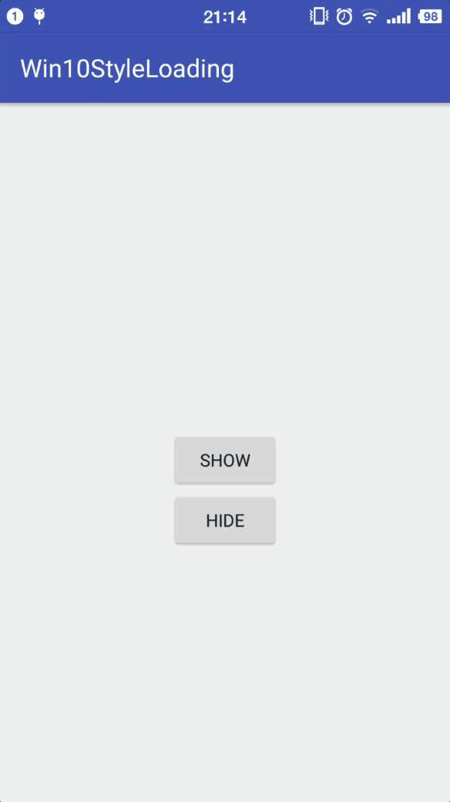
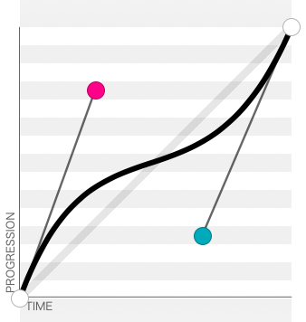
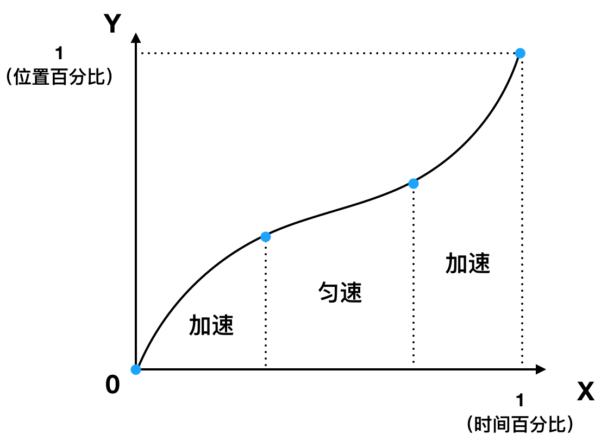
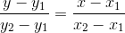
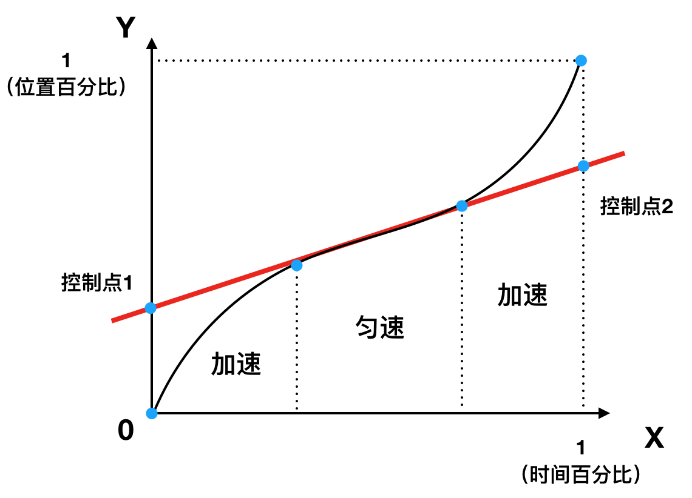
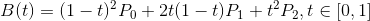
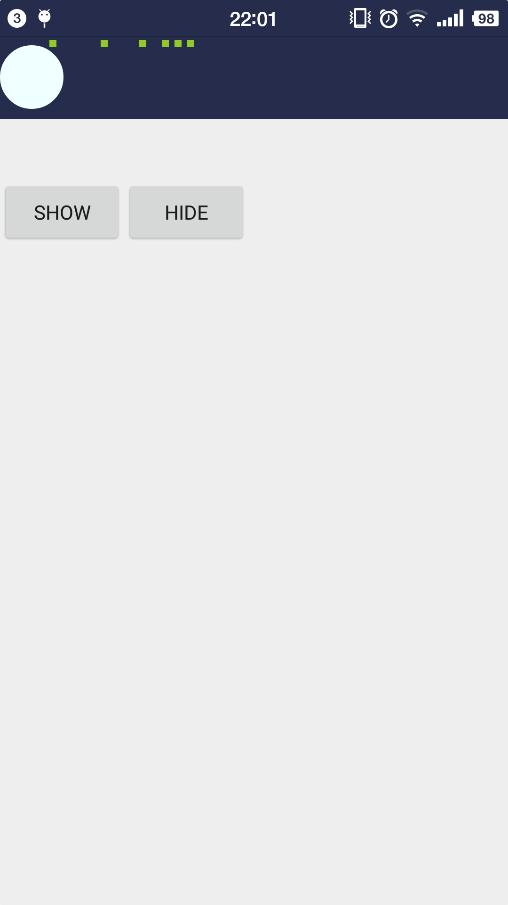
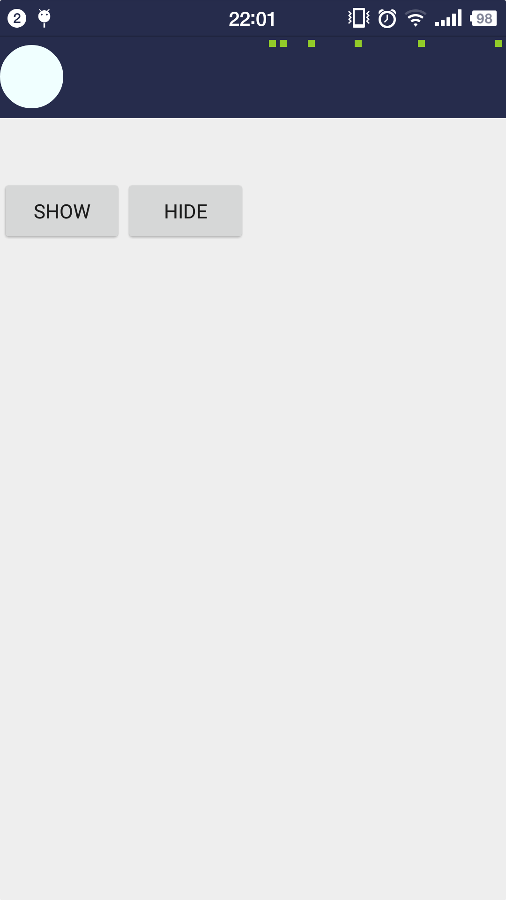

# Win10风格的Loading动画


这是一个Win10风格的加载动画view，思路来自[这篇 Blog](https://blog.csdn.net/a10615/article/details/52745963) 经过学习之后实现了类似Windows Phone经典的加载动画。

<center class="half">
    
</center>


### Usage

```java
git clone https://github.com/CkaiGrac/Win10LoadingView.git
```
##### In your project:
`File -> New -> Import Module` choose Win10LoadingView/win10styleloadinglibrary

##### In your layout file:

```xml
<com.exercise.ckaiself.win10styleloadinglibrary.WinLoadingLinear
        android:id="@+id/loadingLinear"
        android:layout_width="match_parent"
        android:layout_height="10dp"
        android:visibility="invisible">
    </com.exercise.ckaiself.win10styleloadinglibrary.WinLoadingLinear>
```

##### In your Activity:
```java

private WinLoadingLinear loading;
...

 @Override
    protected void onResume() {
        super.onResume();
        loading.show();
    }

@Override
    protected void onPause() {
        super.onPause();
        loading.hide();
    }

```


### 分析
动画由6个小方块组成，分别从屏幕右端加速进入，然后保持匀速运动一小段距离，最后加速离开。
运动变化：加速 -> 匀速 -> 加速
为了保证运动状态改变时显得更为自然，采用贝塞尔曲线



如图形状的贝塞尔曲线可以描述小方块的运动状态变化，可以在[这个网站](http://cubic-bezier.com/#.28,.77,.67,.23)上自定形状然后查看效果。
这里采用自定义时间插值器`TimeInterpolator`，时间的变化范围是从0～1，小方块的运动范围是从屏幕左侧到右侧。图像如下：



接下来可以根据图像，估计每个阶段的坐标点，这些点需要一点一点去调试才知道合不合理。
对于这种图形，可以拆分成两个不完整的二阶贝塞尔曲线分别计算。这是可以利用中间匀速运动的线段来求出加速部分贝塞尔曲线的控制点，由于匀速运动的线段是直线所以可以找到两个点形成的直线近似的描述这条线段，这条直线与另外两条竖线的交点就是贝塞尔曲线的控制点。

两个点求直线公式为： 


```java
private float calculateLineY(double x1, double y1, double x2, double y2, double x) {
        if (x1 == x2) {
            return (float) y1;
        }
        return (float) ((x - x1) * (y2 - y1) / (x2 - x1) + y1);
    }
```
由于我们需要求坐标y的值，因此上述代码将公式变形了。



求出两个贝塞尔曲线的控制点之后，就可以利用二阶贝塞尔曲线的公式计算在某一时刻点的坐标了


二阶贝塞尔曲线公式为：



其中，P0为起点、P1为控制点、P2为终点。

在android中绘制贝塞尔曲线的时候可以只将起点、终点、控制点的横坐标(纵坐标)带入，得到的结果即为某一时刻点的横坐标(纵坐标)。

```java
private float calculateBezierQuadratic(double p0, double p1, double p2, @FloatRange(from = 0, to = 1) double t) {
        double tmp = 1 - t;
        return (float) (tmp * tmp * p0 + 2 * tmp * t * p1 + t * t * p2);
    }
```
注：以上图片都为示意图。
由于是6个小方块依次出现所以需要设置偏移量offset。
```java
final float offset = (float) (index * (100 - 85) * minTimePercentage / (mDotViews.length - 1));
```
`minTimePercentage`其实就是1/100。

有了上面这些准备之后，我们开始构造坐标点。
```java
final double[] mInterpolatorY = new double[]{
                0,
                32 / 100d,
                55 / 100d,
                1
        };
```
```java
final double[] mInterpolatorX = new double[]{
                0 + offset,
                12 * minTimePercentage + offset,
                46 * minTimePercentage + offset,
                58 * minTimePercentage + offset,
        };
```
上面这些坐标只是一调一调出来的。用两个数组存放，一个表示时间插值器坐标系中的Y值`mInterpolatorY`,一个表示时间插值器坐标系中的X值`mInterpolatorX`。修改`mInterpolatorX`的数据可以控制小方块在每个阶段的速度，修改`mInterpolatorY`的数据可以控制小方块在每个阶段的位置。我是懒得再调了。

然后是在自定义时间插值器中判断各个动画的阶段，让小方块按照之前设定好的运动：
```java
mAnimator.setInterpolator(new TimeInterpolator() {
            @Override
            public float getInterpolation(float input) {
                if (input < mInterpolatorX[0]) {
                    if (view.getVisibility() != INVISIBLE) {
                        view.setVisibility(INVISIBLE);
                    }
                    return 0;
                } else if (input < mInterpolatorX[1]) {
                    // the first part: dots accelerate to come in
                    if (view.getVisibility() != VISIBLE) {
                        view.setVisibility(VISIBLE);
                    }
                    input = calculateNewPercent(mInterpolatorX[0], mInterpolatorX[1], 0, 1, input);
                    return calculateBezierQuadratic(mInterpolatorY[0], mControlPointY_1, mInterpolatorY[1], input);
                } else if (input < mInterpolatorX[2]) {
                    // the second part: dots to do uniform motion
                    return calculateLineY(mInterpolatorX[1], mInterpolatorY[1], mInterpolatorX[2], mInterpolatorY[2], input);
                } else if (input < mInterpolatorX[3]) {
                    // the third part: dots accelerate to go out
                    input = calculateNewPercent(mInterpolatorX[2], mInterpolatorX[3], 0, 1, input);
                    return calculateBezierQuadratic(mInterpolatorY[2], mControlPointY_2, mInterpolatorY[3], input);
                } else {
                    // the last part: dots complete animation and come invisible
                    if (view.getVisibility() != INVISIBLE) {
                        view.setVisibility(INVISIBLE);
                    }
                }
                return 1;
            }
        });
```

```java
//calculate a value in a new range base on the old range
private float calculateNewPercent(double oldStart, double oldEnd, double newStart, double newEnd, double value) {
        if ((value < oldStart && value < oldEnd) || (value > oldStart && value > oldEnd)) {
            throw new IllegalArgumentException(String.format("参数输入错误，value必须在[%f, %f]范围中", oldStart, oldEnd));
        }
        return (float) ((value - oldStart) * (newEnd - newStart) / (oldEnd - oldStart));
    }
```


上面代码中，input的取值范围是从0～1，这个参数走到1说明动画结束了。我们拿mInterpolatorX和input比较判定是动画的哪一个阶段，然后根据情况设定小方块的Visibility。
正常情况下，动画在执行时间duration内，从起点到终点，中间是匀速运动，每一时刻都对应着固定的位置。为了统一，把时间 0～duration 转换成时间百分比 0～1 。
在每个阶段都 return当前时刻在贝塞尔曲线上的坐标值，这样就控制了小方块运动。

### 合适loading展示位置

<center class="half">
     
</center>
